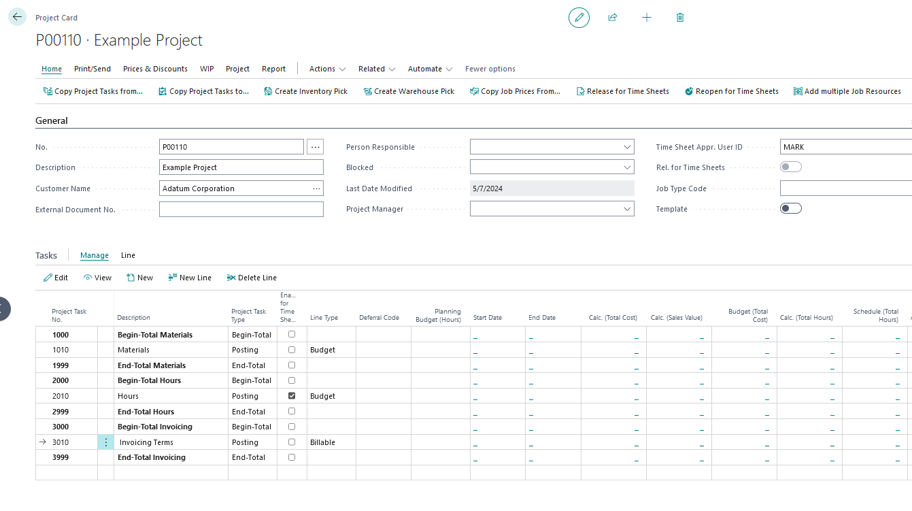
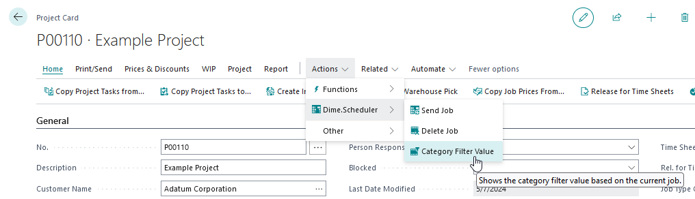
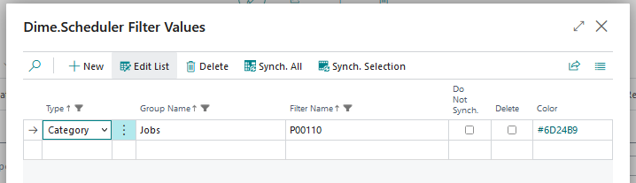
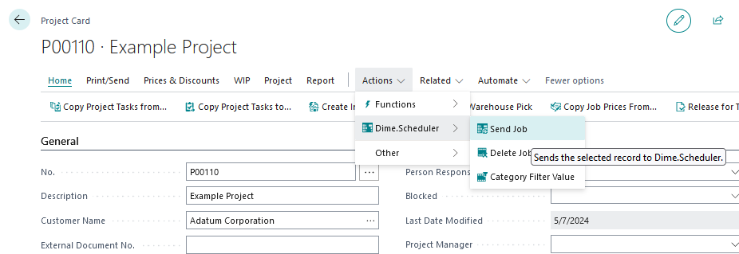
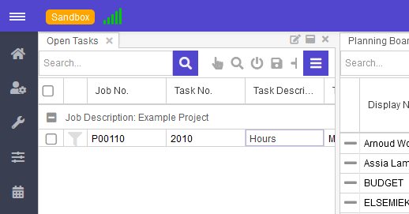
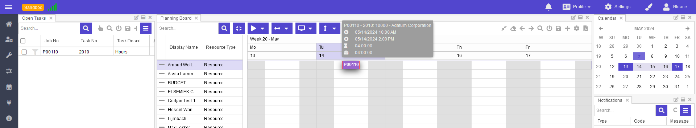
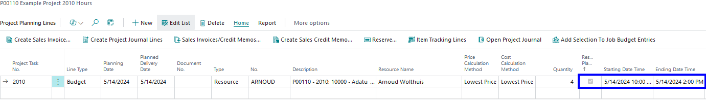

# Manual Extended Time Sheets Dime.Scheduler

## General use

### Create project in Business Central
Create a project in Business Central. Make sure that at least one project task is Enabled for Time Sheets:

With the action Category Filter Value, a color can be defined that is used for the appointments in the planning board in Dime.Scheduler:

### Send project to Dime.Scheduler
Use the action on the Project to send it to Dime.Scheduler:

This makes the job task with Enabled for Time Sheets available in the Open Tasks window:

### Plan project in Dime.Scheduler
Drag and drop the task from the Open Task part to the planning board. An appointment block will be created with the length that is defined during the FastTrack Wizard. In this example 4 hours.

### Get the results as Project Planning Lines in Business Central
In the background, Dime Scheduler created a budget Project Planning Line for the chosen resource. This record has the field Resource Planning enabled and contains the starting date/time and ending date/time.

[:arrow_left:](../README.md) [Back](../README.md)