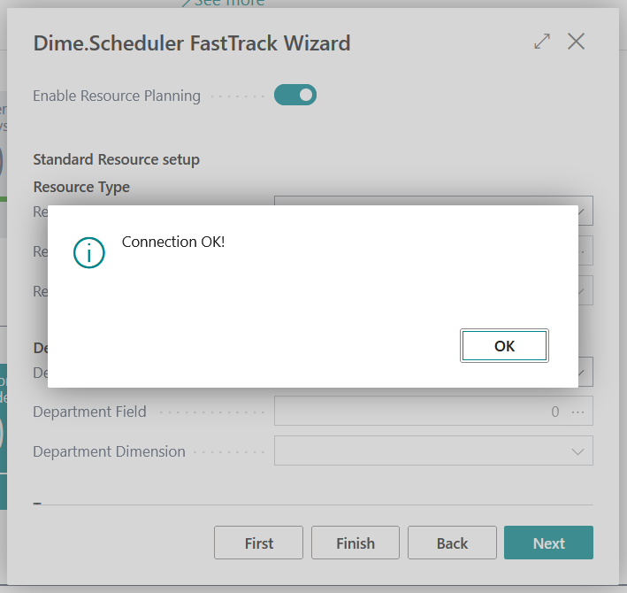
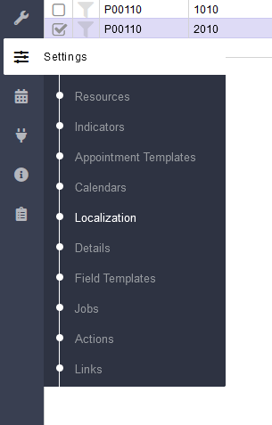

# Manual Extended Time Sheets Dime.Scheduler

## Setup

Because the Dime.Scheduler platform is a cloud service, data must be sent from Business Central to Dime.Scheduler to be able to plan projects. When an appointment is created in Dime.Scheduler, the system will need a web service connection to Business Central to send the result.
The following steps set up a basic integration for jobs with Dime.Scheduler. 
For more detailed information, please visit https://docs.dimescheduler.com.

### Business Central

**FastTrack Wizard**

1.	Choose the Search icon, Enter Dime.Scheduler FastTrack Wizard and choose the related link.
2.	On the first page of the wizard, supply a unique identifier for your environment/company combination as Source App. The fields Scheduler Url, Scheduler User and Scheduler Password must be filled with the information supplied by Dime.Scheduler.

3.	When clicking Next, the information is checked. When a connection could be established based on the entered information, the following dialog is shown:

4.	In the following steps, at least the following information must be entered:

5.	After finishing the wizard, the system will ask to synchronize to Dime.Scheduler. Answer this question with Yes, which synchronizes at least the resources from Business Central to Dime.Scheduler.

**Filter Groups**

1.	Choose the Search icon, Enter Dime.Scheduler Filter Groups and choose the related link.
2.	Create a record for Type ‘Category’ with as Group Name ‘Jobs’. This category will define the color of the appointment for the job in Dime.Scheduler.

3.	Go to the Filter Group Sources

4.	Create the following record. This will be used to determine which value will be opened from the Project Card/Project List later.

**Scheduled Sync**

1.	Choose the Search icon, Enter Job Queue Entries and choose the related link.
2.	Create a new entry for codeunit 2087634 (Dime DS Scheduled Synch.). This entry must be scheduled periodically to ensure that all setup data regarding Dime.Scheduler from Business Central is synchronized.

### Dime.Scheduler

**Connection to Business Central**

Dime Scheduler communicates with Business Central through SOAP web services. For this purpose, two records are automatically added to the Web Services table in Business Central when the Dime.Scheduler app is installed. To be able to access the web service from Dime.Scheduler, a registered application must be created in Microsoft Entra. More information on how to do that can be found here: https://docs.dimescheduler.com/backoffice/bc/install/authentication 
Please note that when setting up the registered application in Business Central, at least also permission sets for License Permission User, Extended Time Sheets and Extended Time Sheets (Dime Scheduler) must be included. In this demo SUPER (DATA) is used, but a more fine-grained permission set is advised.
When the published application is granted permission in Business Central, the Business Central connector can be added to Dime.Scheduler:

Enter a Name and a Description for the connector. Make sure that the field Source Application is filled with exactly the value that is also used during the setup in Business Central. Send appointment must be enabled.

BackOffice system must be set to Dynamics Business Central (SaaS) and the Web Service URL is the SOAP URL of the web services for Appointments.

The field Login must be filled with the Microsoft Entra Tenant ID.
In the password field, take the following string and replace **CLIENTID** and **CLIENTSECRET** with the corresponding values from the app registration: **client_id=CLIENTID&client_secret=CLIENTSECRET**

**Add localization for Enabled for Time Sheets**

In Dime.Scheduler go to Localization:

Select FreeBit2 for Source Table ‘Task’ and make sure that the following translations are set
- English (US) / en-US: Enabled for Time Sheets
- Dutch / nl: Ingeschakeld voor urenstaten

**Filter open task**

To make sure that open tasks part of the scheduler only contain project tasks that are enabled for Time Sheets, we have to add the field Enabled for Time Sheets. This can be done by clicking the small triangle next to an existing field name, go to columns and check the field Enabled for Time Sheets.

When the field is added. Set a filter on the field. Again, this can be done by clicking on the small triangle and go to Filters:

When this is done, the field Enabled for Time Sheets may be removed again from the open tasks part. 

> [!IMPORTANT]
Make sure that the modifications to the part are saved in a profile.

[:arrow_left:](../README.md) [Back](../README.md)